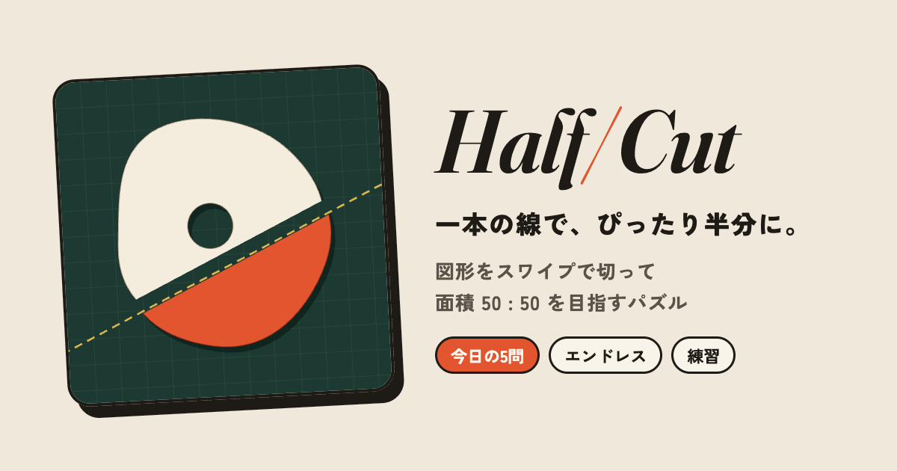
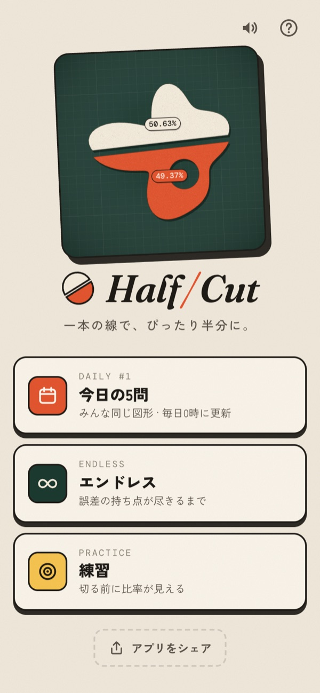
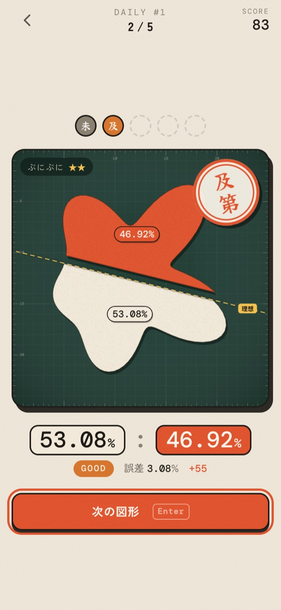
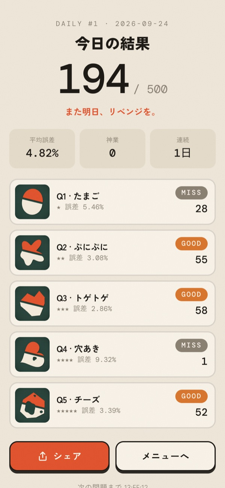

# Half/Cut — 一本の線で、ぴったり半分に。

<p align="center">
  
</p>

<h3 align="center">▶ <a href="https://t-of.github.io/Half-Cut/">いますぐ遊ぶ — t-of.github.io/Half-Cut</a></h3>

<p align="center">インストール不要・無料。スマホでも PC でも、ブラウザで開くだけで遊べます。</p>

---

**Half/Cut** は、図形をスワイプ一本で **面積 50 : 50** に切り分けるパズルゲームです。
カッティングマットに置かれた紙を、目測だけを頼りに真っ二つに。ルールは単純なのに、穴や離れた島が出てくると途端に難しくなります。

<p align="center">
  
  
  
</p>

## 🔗 リンク

- 遊ぶ: https://t-of.github.io/Half-Cut/
- ソース: https://github.com/t-of/Half-Cut
- 制作: [T.OF...](https://t-of.github.io/)

## 遊び方

1. 図形を**横切るようにスワイプ**（PC ならドラッグ）すると、その直線で紙が二つに切れます。線は盤面の端まで伸びます。
2. 切れた二つの面積が **50 : 50 に近いほど高得点**です。1 問 100 点満点で、誤差 10% で 0 点になります。
3. 切ったあとには、同じ角度でぴったり半分になる**理想の線**が表示されます。ずれの向きと大きさを確かめて、次に活かしましょう。
4. **穴**の部分は面積に入りません。**離れた島**がある図形は、島を全部まとめて半分にします。

| 判定 | 誤差 |
| :-- | :-- |
| 神業 PERFECT | 0.3% 以下 |
| 見事 EXCELLENT | 1% 以下 |
| 上手 GREAT | 2.5% 以下 |
| 及第 GOOD | 5% 以下 |
| 未熟 MISS | 5% 超 |

## モード

| モード | 内容 |
| :-- | :-- |
| **今日の5問** | 日付ごとに全員が同じ 5 問に挑戦します。1 問ごとに難しくなり、途中でやめても続きから再開できます。結果は絵文字つきでシェアできます。 |
| **エンドレス** | 持ち点は誤差 12% 分。切るたびに誤差が引かれ（1 回あたり最大 6）、0 になったら終了です。上手以上なら少し回復し、続けるとコンボ倍率（最大 ×2.0）がかかります。3 枚ごとに難易度が上がります。 |
| **練習** | 難易度 1〜5 を選べます。ドラッグ中に比率が表示され、同じ図形を何度でも切り直せます。 |

図形は、三角形・四角形・たまごのような素直な形から、星・ハート・L 字や十字・C 字・くし形、穴あき・ドーナツ・チーズ、複数の島が散らばる群島まで 16 種類あり、5 段階の難易度に振り分けて毎回ランダムに生成されます。

## アプリとして入れる（PWA）

アプリのように全画面で起動し、オフラインでも遊べます。

- **Android（Chrome）**: タイトル画面の「ホーム画面に追加」をタップ
- **iPhone（Safari / Chrome）**: 共有ボタン →「ホーム画面に追加」（タイトル画面のボタンを押すと手順が表示されます）

友だちに勧めるときは、タイトル画面の「アプリをシェア」から送れます。

---

## 開発

ビルド不要の Vanilla JavaScript（ES Modules）+ Canvas 2D で作っています。依存パッケージはありません。

### ローカルで動かす

ES Modules を使っているため、`index.html` を直接開くのではなく、ローカルサーバー経由で開いてください。

```sh
git clone https://github.com/t-of/Half-Cut.git
cd Half-Cut
npm start   # → http://localhost:5173
npm test    # ジオメトリと図形生成のテスト（Node.js 20 以上）
```

`npm start` の代わりに `python3 -m http.server` や VS Code の Live Server でも動きます。

### ファイル構成

```
index.html              画面（タイトル / ゲーム / 結果 / 遊び方）
css/style.css           スタイル（ライト / ダーク対応）
src/
  main.js               画面遷移・モード・入力・結果表示・シェア
  geometry.js           面積・重心・半平面クリッピング・理想の線の計算
  shapes.js             難易度別の図形ジェネレーター
  renderer.js           Canvas 描画（マット・紙・切断アニメーション・サムネイル）
  scoring.js            判定・得点・エンドレスの持ち点・デイリーの日付
  audio.js              Web Audio で合成する効果音
  storage.js            localStorage ラッパー
  rng.js                シード付き乱数（デイリーの問題を全員で揃えるため）
sw.js                   Service Worker（オフライン対応）
manifest.webmanifest    PWA マニフェスト
icons/                  アプリアイコン・シェア用カード画像
tests/                  node:test によるテスト
```

### しくみ

- **面積は厳密に計算しています。** 図形は「外周」と「穴」の多角形の集まりとして持ち、切断線でできる半平面で各多角形を Sutherland–Hodgman 法でクリッピングしてから、符号付き面積を足し合わせます。凹んだ形でも穴があっても、誤差は浮動小数点の範囲に収まります。
- **理想の線**は、切った線と同じ向きのまま位置を二分探索して求めています。
- **図形が壊れないことを保証しています。** 穴や島は、周囲との最短距離（クリアランス）を確かめてから置くので、多角形どうしが交差しません。テストでは各難易度 300 個ずつ生成して、交差がないことと穴が外周からはみ出さないことを検証しています。
- **今日の5問**は、日付から作ったシードで乱数を初期化しているので、サーバーなしで全員が同じ問題を解けます。

### 手を入れるときのメモ

- 判定の境目・得点の式・エンドレスの持ち点などの数値は `src/scoring.js` にまとまっています。
- 新しい図形は `src/shapes.js` の `GENERATORS` に追加します。`tiers` で出現する難易度を指定してください。
- Service Worker はアプリのファイルをネットワーク優先で取得するので、普段の更新ではキャッシュを気にする必要はありません。`src/` にファイルを追加・削除したときだけ、`sw.js` の `APP_SHELL` を更新して `VERSION` を上げてください。
